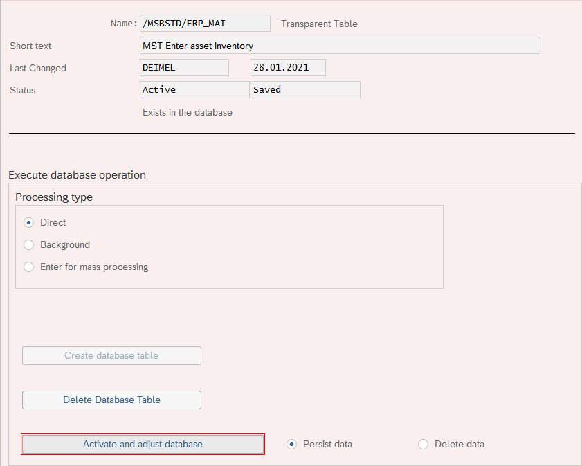

## ATC - ABAP Test Cockpit

### Reminder

> Old Move type conflict (Type DZLSHB_F15, Note: 0002610650) STRUCTURE -> C

```abap
DATA:  gt_item        TYPE rfkord_t_item, "fail with type DZLSHB_F15
       lr_data        TYPE REF TO data,
       ls_ads_dataref TYPE /softw/sads_dataref, " refname -> string | data -> ref data
       lt_ads_dataref TYPE /softw/pads_dataref. " table of /softw/sads_dataref

GET REFERENCE OF gt_item INTO lr_data.
ls_ads_dataref-data ?= lr_data.
APPEND ls_ads_dataref TO lt_ads_dataref.
```

ToDo: Run test in test-system and if it works apply for exemption.

### Select from SKB1

**The ABAP Test Cockpit throws following warning:**

DB Operation SELECT found (SKB1, see Note(s):[0002431747](https://launchpad.support.sap.com/#/notes/2431747))

In the SAP Note [2431747](https://launchpad.support.sap.com/#/notes/2431747) I found following text passage: As a consequence, read-access to SKA1 and SKB1 will in general return also secondary cost elements; this is different to releases before S/4HANA.

**Coding:**
```abap
SELECT SINGLE bukrs saknr xopvw
    FROM skb1
    INTO ls_xopvw
    WHERE bukrs = accit_glx-bukrs
    AND saknr = accit_glx-hkont.
```

**Solution:**

Warning should be suppressed with `"#EC CI_DB_OPERATION_OK[2431747]` cause `saknr` is unique for primary and secundary accounts.

### /msbstd/erp_mai

```abap
" ZMSB_MAI_F01
      ls_stammdaten-ahk = ls_anlc-kansw + ls_anlc-answl.
      ls_stammdaten-rbw = ls_anlc-kansw
                          + ls_anlc-answl
                          + ls_anlc-kaufw
                          + ls_anlc-aufwp
                          + ls_anlc-kinvz
                          + ls_anlc-invzm
                          + ls_anlc-knafa
                          + ls_anlc-nafap
                          + ls_anlc-kaafa
                          + ls_anlc-aafap
                          + ls_anlc-kaufn
                          + ls_anlc-aufnp
                          + ls_anlc-ksafa
                          + ls_anlc-safap
                          + ls_anlc-nafam
                          + ls_anlc-safam
                          + ls_anlc-aafam
                          + ls_anlc-mafam.
```

Maybe after transport database needs a "refresh".

For this you have to go into transaction `SE14` and select the table `/MSBSTD/ERP_MAI` and activate and adjust the database.


